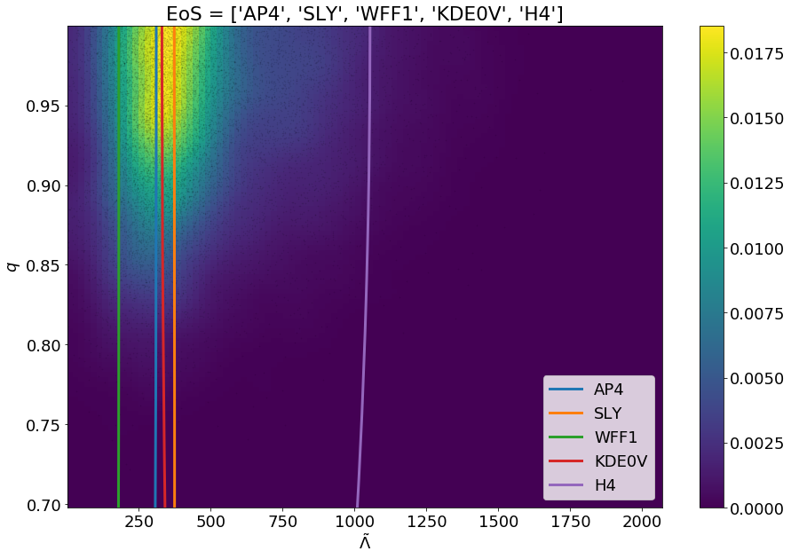
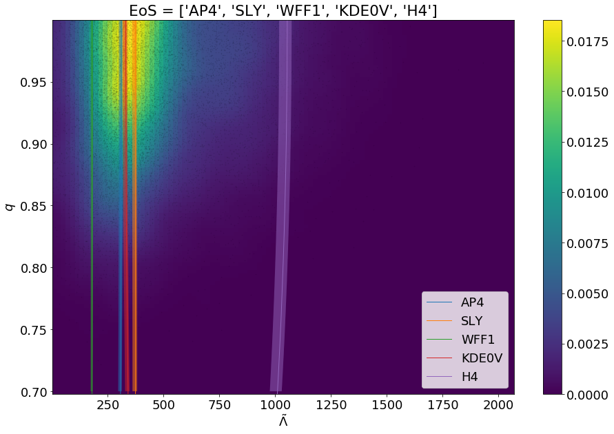

.. GWXtreme documentation master file, created by
   sphinx-quickstart on Tue Jul 23 14:30:07 2019.
   You can adapt this file completely to your liking, but it should at least
   contain the root `toctree` directive.

Documentation of GWXtreme
=========================

Introduction:
-------------
GWXtreme package hosts tools for inferences on extreme matter using
gravitational wave parameter estimation data. Currently available tools include
the following:

1. Model selection of the neutron star equation of state using gravitational wave
   parameter estimation results.

Neutron star equation of state model selection:
-----------------------------------------------
Our knowledge of the equation of state of neutron star exhibits a fundamental
gap in our understanding of matter at extreme density and pressure. It is
impossible to replicate such environments in human-made laboratories, making us
relying entirely on astrophysical observations. Investigations conducted in this
field have been predominantly focussed on observation of pulsars and x-ray
binaries in the electromagnetic spectrum.

The direct detection and characterization of gravitational wave from a pair of
binary neutron stars in 2017, GW170817_, has propelled the field immensely by
opening a new window of studying the universe at extreme densities. The tidal
interaction between the two neutron stars participating in a coalescence event
leaves its imprint in the gravitational wave detected by the ground-based
gravitational wave interferometers. Powerful Bayesian parameter estimation
techniques are able to extract this information from the noisy data. The
LIGO/Virgo collaboration conducts such parameter estimation and releases the
resulting posterior samples for public consumption. This tool enables the user
to use such posterior samples and conduct model selection of their favorite
neutron star equations of state. They can compute bayes-factor between pairs of
the equation of state of their choice, or compare against some of the well known
neutron star equation of state in the literature. There are two important
caveats associated with this tool, however:

**1. This is an approximation method:** The method incorporates a series of
approximations highlighted in the following paper_. The resulting bayes-factor
is therefore always an approximate quantity. To compute a more accurate value of
the bayes-factor one will need to conduct Bayesian Markov Chain Monte Carlo on
the gravitational wave data using priors for the gravitational wave parameters
consistent with the given equation of state. This was conducted in a study by
the LIGO/Virgo collaboration and published in the `LVC Model selection paper`_.
However, this method is many orders of magnitude computationally more expensive
than the approximation method we are presenting.

**2. This method requires a special choice of prior:** This has been discussed
in detail in the aforementioned paper_. For the approximation scheme to work,
we need to conduct the parameter estimation with a specific combination of
gravitational wave parameters. We also need to impose a specific choice of
priors on a subset of these parameters. Thus, the user is advised to only use
the posterior samples generated and provided for this particular type of study.
The user of course can generate their own posterior samples from the `publicly
available gravitational wave strain data`_, however, they should make sure to
understand the specific run parameters and priors required to use this method.

Installation:
.............

* **Installation using pip:** The simplest and the safest way to install
  GWXtreme in your system is to create a virtual environment and use pip to
  install the package.

    .. code-block:: shell

       pip install GWXtreme

* **Installation from source:** If the user wants to install from the latest
  build instead of the latest release version, this can be done by cloning the
  latest master of the repository (works best in a virtual environment).

  .. code-block:: shell

     git clone https://github.com/shaonghosh/GWXtreme.git
     cd GWXtreme
     python setup.py install

The methods:
............
.. _method:

To compute the bayes-factor from posterior samples of a given event, the user
needs to first instantiate a model-selection object.

.. code-block:: python
   :linenos:

   from GWXtreme import eos_model_selection as ems
   modsel = ems.Model_selection(posteriorFile='samples.dat',
                                priorFile=None)

If the user has access to the prior distribution of the parameters in a
`prior_samples.dat` file, then this should be supplied with the
`priorFile` kwarg.

There are currently three types of methods available for computation of the
bayes-factor using this tool. One can use one of the various tabulated equations
of state in LALsuite_ to compute the bayes-factor between them. Alternatively,
one can supply the mass-tidal deformability information corresponding to a given
equation of state to the code to compute the bayes-factor. Finally, it is also
possible to pass the mass-radius-:math:`\kappa_2` information for a given
equation of state, where :math:`\kappa_2` is the tidal Love number. It is not
possible currently to directly pass the pressure-density information for an
equation of state.

* **Tabulated equation of states from LALsuite:** A number of equations of
  states are recognized by the LALSimulation library of LALsuite_. The user can
  simply invoke one of these models by passing its name in the argument,

  .. code-block:: python

     ap4_sly_bf = modsel.computeEvidenceRatio(EoS1='AP4', EoS2='SLY')

  which gives us the bayes-factor between the `AP4` and the `SLY` equations of
  state. Also read :ref:`General Comments<comments>` for more details.

* **From mass-tidal deformabilty files:** If the user wants to find the
  bayes-factor of an equation of state model w.r.t another equation of state
  model, where either one or both of the models are not present as one of the
  tabulated equations of state in LALsuite_, then the user can supply the
  information of the equation of state in the form of a text file with the mass
  and the tidal deformability information. This information must be present in
  exactly two columns, the first column being the mass in units of solar mass,
  and the second column having the tidal deformability values in S.I. units,

  .. code-block:: python

     ap4_sly_bf = modsel.computeEvidenceRatio(EoS1='ap4_m_lambda.txt',
                                              EoS2='SLY')

  where, once again we are computing the bayes-factor between `AP4` and the
  `SLY` equations of state, except this time we are obtaining the data for the
  `AP4` from a user supplied file. Note that the kwarg is the same as before.
  The method looks for the file first, and if it does not find it in the
  location, it assumes that the value of the argument is the name of the
  equation of state. In this case if the file `ap4_m_lambda.txt` is not present
  in the current working directory, the method will try to use a LALsuite_
  defined equation of state named `ap4_m_lambda.txt`, which it will not find and
  hence fails.

* **From MRLove files:** The third way one can compute the bayes-factor is
  a supplementary tool where the user can supply the mass, the radius and the
  tidal Love number of neutron star for the given equation of state. This method
  is included since the mass-radius information for neutron stars are
  particularly common representation of equation of states. To invoke this
  method the user needs to supply the mass-radius-:math:`\kappa_2` information
  in a text file with exactly three columns. The first column should be the mass
  of the neutron star in solar mass, the second column should be the radius of
  the neutron star in meters, and the third column should be the value of the
  tidal Love number.

  .. code-block:: python

     ap4_sly_bf = modsel.computeEvidenceRatio(EoS1='ap4_m_r_k.txt',
                                              EoS2='SLY')

  Once again it is important to make sure that the referred file exists in the
  location supplied else the method will assume that the name of the file is
  that of a LALsuite_ tabulated equation of state. It is also important to note
  that the method interprets the presence of three columns as a file with
  mass-radius-:math:`\kappa_2` information and the same with two columns as a
  file with mass-tidal deformability information.

* **From piecewise values:** The fourth way one can compute the bayes-factor is 
  by supplying the pressure and gammas of a neutron star for the given equation
  of state. To invoke this method the user needs to supply the equation of state 
  as a list of log_p0_SI, g1, g2, and g3 values. 

  .. code-block:: python

     ap4_sly_bf = modsel.computeEvidenceRatio(EoS1=[33.269,2.830,3.445,3.348],
                                              EoS2=[33.384,3.005,2.988,2.851])

Advanced features:
..................

Bayes-factor uncertainty estimation:
""""""""""""""""""""""""""""""""""""
Given the fact that this is an approximation scheme, we also provide a feature
which can be used to estimate the uncertainty in the computation of the
bayes-factor. The details of the method are explained in the methods paper_.
To summarize the method here, the approximation technique uses kernel density
estimation to re-sample the original posterior samples multiple times and then
computes the bayes-factor for each new re-samples. Results from these
various iteration are then used to compute the standard deviation of the
bayes-factor, which gives us an estimate of the uncertainty of the bayes-factor.
The application of this method however increases the computational requirement.
To address the increased runtime due to the computational overload resulting 
from these trials, from GWXtreme 0.3.0 we have introduced parallelization of 
the trial Bayes-factor computation using Ray_. Currently, the code determines
the number of cores available in a given machine and then distributes the number
of trials as uniformly as it can across all the cores. Currently, no feature has
been provided to micromanage this distribution. In a future release this will be
included.

**NOTE:** The Ray distribution may cause problems when running on JupyterHub. No
problem occurs when running on Jupyter notebook.

.. code-block:: python
   :linenos:

   import numpy as np
   from GWXtreme import eos_model_selection as ems
   modsel = ems.Model_selection(posteriorFile='samples.dat',
                                priorFile=None)
   ap4_sly_bf, bf_trials = modsel.computeEvidenceRatio(EoS1='AP4',
                                                       EoS2='SLY',
                                                       trials=100)
   uncertainty = np.std(bf_trials)

In the above example one hundred re-sampling were conducted to get the result.
In the methods paper_ ten thousand re-sampling were conducted to get the
results. The uncertainty computation can also be conducted for the equation of
state whose data was supplied from files, using the same syntax.

Save results in JSON files:
"""""""""""""""""""""""""""
The results from the bayes-factor computation can also be saved in JSON format 
for future analysis and postprocessing. This feature is only available when the 
number of trials is greater than 0. Use the keyword `save` to pass the name of 
the JSON file where the data will be saved. 

.. code-block:: python
   :linenos: 

   from GWXtreme import eos_model_selection as ems
   modsel = ems.Model_selection(posteriorFile='samples.dat',
                                priorFile=None)
   modsel.computeEvidenceRatio('AP4', 'SLY', trials=10,
                               save='bayes_factor_ap4_sly.json'

The resulting JSON file looks like as follows:

.. code-block:: python

   {
     "bf": 1.0783080269512513,
     "bf_array": [
       1.0602546775709871,
       1.043219903278589,
       1.0567744311697058,
       1.0598349778783323,
       1.0433201330742048,
       1.0538215562925697,
       1.0445375050779768,
       1.0712610476841586,
       1.0606600260367158,
       1.0634382129867201
     ],
     "ref_eos": "SLY",
     "target_eos": "AP4"
   }

The field `bf` stores the value of the Bayes factor between the two equation of 
states (`target_eos` and `target_eos`). The field `bf_array` stores the same for 
the various trials.

Combining Bayes-Factors from multiple events:
"""""""""""""""""""""""""""""""""""""""""""""
If the equation of state of neutron star is a universal property of matter at
high density, then we should be able to combine data from multiple gravitational
wave detections from coalescence of compact binary objects and get a joint
inference on the bayes-factor of the equation of state. We have implemented this
using a method of stacking that has been described in paper_. This method is
described below:

.. code-block:: python
   :linenos:

   from GWXtreme import eos_model_selection as ems
   stackobj = ems.Stacking(['samples_1.dat', 'samples_2.dat',
                            'samples_3.dat'],
                           labels=['first event', 'second_event',
                                   'third event'])
   joint_bf = stackobj.stack_events('AP4', 'SLY')

In this example the quantity `joint_bf` gives the joint bayes-factor between
equation of state models `AP4` and `SLY` for three events. Note that the
argument `labels` is optional, and is only useful if you are using the plotting
tool discussed in :ref:`Plotting tool for stacking<stackplot>`.

One can also access the Bayes-factors for each individual event from the object
`stackobj` created above.

.. code-block:: python

   all_bayes_factors = stackobj.all_bayes_factors

This will return a list whose elements are the Bayes-factor for all the three
events.
Furthermore, the user can also use the KDE-resampling method to estimate the
uncertainty in the computed bayes-factor for the stacked Bayes-factors too.

.. code-block:: python

   joint_bf = stackobj.stack_events('AP4', 'SLY', trials=100)

The Bayes-factor for the individual events and their uncertainty can be obtained
using the object `stackobj`:

.. code-block:: python

   all_bayes_factors = stackobj.all_bayes_factors
   all_bayes_factors_uncert = stackobj.all_bayes_factors_errors

Where, once again the Bayes-factor of each event is accessed from the list
`all_bayes_factors` and the uncertainties for each event is computed using the
standard deviation of the resamples for each case and is returned in the list
`all_bayes_factors_uncert`.

Save results in JSON files:
"""""""""""""""""""""""""""
The results from thestacking of BF computation can also be saved in JSON format
for future analysis and postprocessing. Use the keyword `save` to pass the name
of the JSON file where the data will be saved.

.. code-block:: python
   :linenos:

   from GWXtreme import eos_model_selection as ems
   stackobj = ems.Stacking(["samples1.dat", "samples2.dat",
                            "samples3.dat"],
                            labels=['first event', 'second event',
                                    'thirdevent'])
   stackobj.stack_events('AP4', 'SLY', trials=5,
                         save='stack_result_ap4_sly.json')

Visualization tools:
""""""""""""""""""""
We currently provide a method of visualization of the equation of state models.
This enables the user to visually find out how well any model fit the posterior
samples data. This method is a member of the `Model_selection` class and hence
can only be invoked after the `modsel` object is defined. We show below an
example function call where we have used the named equation of state models that
are defined in LALsuite_.
Also read :ref:`General Comments<comments>` for more details.

.. code-block:: python
   :linenos:

   modsel = ems.Model_selection(posteriorFile='samples.dat')
   modsel.plot_func(['AP4', 'SLY', 'WFF1', 'KDE0V', 'H4'],
                    filename='fits_of_models_with_data.png')

This will generate a png file in the current working directory named
`fits_of_models_with_data.png` which will have the visualization.

   Given the choice of the equation of state models the user can plot them
   against the posterior distribution. The models whose curves passes-by closest
   to the posterior distribution (yellow-green region) have the highest
   Bayes-factors.

The above figure will be generated upon execution of the code snippets. The user
can also supply custom equation of state models using the text file feature as
discussed in the :ref:`The methods<method>` section. The list of the equation of state
models that the user wants to use must be passed as a python list, unless the
user wants to plot just a single equation of state model, in that case just a
string of the model name or the name of the file will suffice.

One can also remove the constraint on fixing the chirp mass to its mean value
by passing the argument `full_mc_dist=True` as shown below:

.. code-block:: python
   :linenos:

   modsel = ems.Model_selection(posteriorFile='samples.dat')
   modsel.plot_func(['AP4', 'SLY', 'WFF1', 'KDE0V', 'H4'],
                    filename='models_with_data_full_mc_dist.png',
                    full_mc_dist=True)

This will generate a png file in the current working directory named
`models_with_data_full_mc_dist.png` which will have the visualization.

   Setting the full_mc_dist boolean argument to true allows the user to get the
   full extent of the chirp-mass distribution in the plot.

Plotting tool for stacking:
"""""""""""""""""""""""""""
.. _stackplot:

The result of the stacking can be plotted using a plotting tool that we provide
along with the package. The plotting method is a member of the `Stacking` class
thus needs the defining of the stacking object.

.. code-block:: python
   :linenos:

   from GWXtreme import eos_model_selection as ems
   stackobj = ems.Stacking(['samples_1.dat', 'samples_2.dat',
                            'samples_3.dat'],
                           labels=['first event', 'second_event',
                                   'third event'])
   stackobj.plot_stacked_bf(eos_list=['AP4', 'SLY', 'H4'],
                            ref_eos='SLY', trials=100)

This will generate a plot in the present working directory where the results
from the stacking of Bayes-factor w.r.t `SLY` will be plotted for the equation
of states `AP4, SLY, H4`. The location of the plotted file can be configured
using the kwarg `filename`.

General Comments:
.................
.. _comments:

Note that if the user supplies a name of the equation of state model that is not
defined in LALsuite_ this will result in the termination of the code. Thus, an
error will occur if the user does not supply the correct path to the
custom data file for the equation of state model. The method will then interpret
the wrongly supplied filename as an equation of state model name, and fail.

A list of all equation of state model names recognized by the version of
LALsuite_ installed in your environment can be obtained as follows:

.. code-block:: python
   :linenos:

   modsel = ems.Model_selection(posteriorFile='samples.dat')
   modsel.getEoSInterp()

which will print the names of the recognized models in the standard I/O.

.. _GW170817: https://arxiv.org/abs/1710.05832
.. _paper: https://arxiv.org/abs/2104.08681
.. _LVC Model selection paper: https://arxiv.org/abs/1908.01012
.. _publicly available gravitational wave strain data: https://www.gw-openscience.org/catalog/GWTC-1-confident/html/
.. _LALsuite: https://git.ligo.org/lscsoft/lalsuite
.. _Ray: https://ray.io

.. toctree::
   :maxdepth: 2
   :caption: Contents:

   code

Indices and tables
==================

* :ref:`genindex`
* :ref:`modindex`
* :ref:`search`
