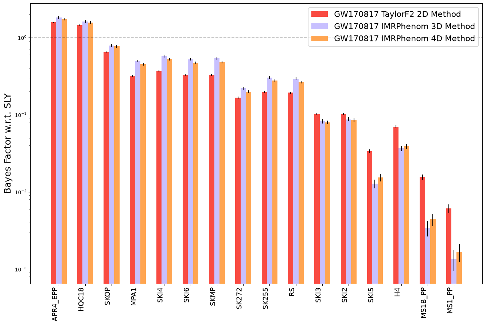
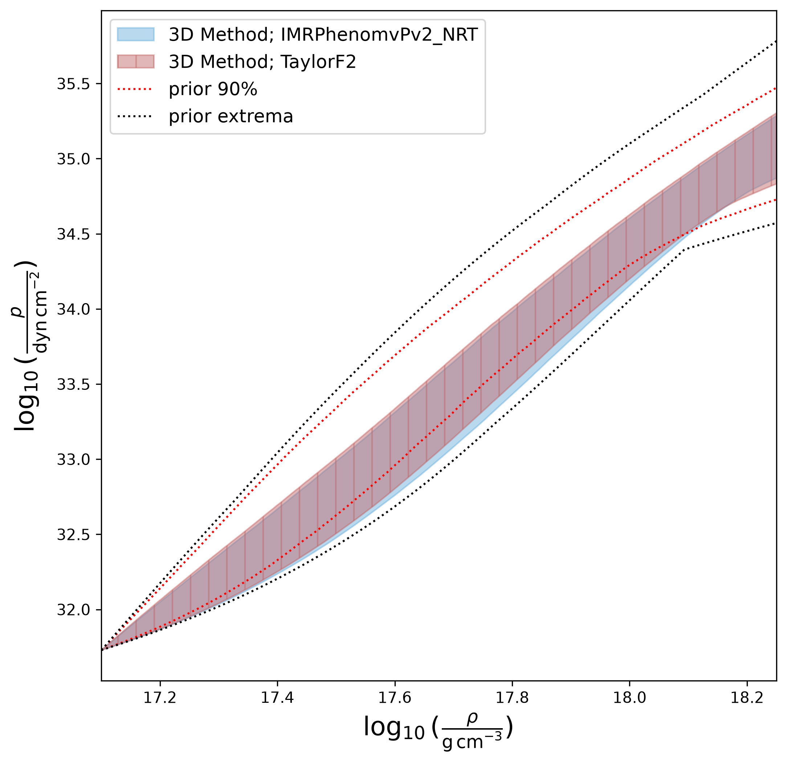

GWXtreme Documentation
======================

**GWXtreme** `[1]`_ `[2]`_ is a package providing efficient algorithms to conduct approximate Bayesian inference of the neutron star equation of state from both gravitational wave detections of binary neutron star or neutron star-black hole mergers and simultaneous mass-radius measurements of pulsars.
Currently available tools include:

1. Model selection of the neutron star equation of state.
Models can be specified as:

      * named, tabulated models available in LALSuite (such as APR4_EPP, SLY)
      * mass, tidal deformability data files
      * mass, radius, tidal Love number data files

2. Parameter estimation of parameterized equation of state models.
Available parameterized models include:

      * 4-parameter spectral decomposition
      * 4-parameter piecewise polytrope

Model selection is useful for quickly comparing proposed equation of state models, while parameterized inference can provide direct constraints on the pressure-density relation of cold nuclear matter.
The below figures illustrate the types of results that can be produced using these two inference capabilities of GWXtreme.

.. toctree::
   :maxdepth: 3
   :caption: Getting Started

   installation
   inference_methods
   examples/index

.. toctree::
   :maxdepth: 3
   :caption: API Reference

   gwxtreme

.. _`[1]`: https://doi.org/10.1103/PhysRevD.104.083003
.. _`[2]`: https://doi.org/10.1103/PhysRevD.107.043035